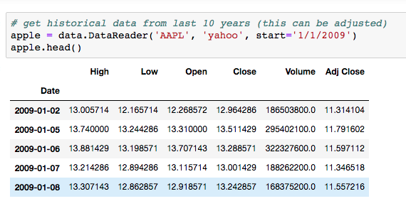

# Stock Price Analysis Using Monte Carlo Simulations

## Intro

Being an investor who has a portfolio of over 30 individual stocks, I have always been interested in how Data Science and Machine Learning can be used to analyze and predict stock prices. This notebook is the start of my exploration of this concept.

## Data

The data used for this notebook are historical stock prices for Apple(AAPL) and Frontdoor Inc.(FTDR) using a very helpful package called pandas-datareader which you can read more about [here](https://pypi.org/project/pandas-datareader/). Using this package is pretty straighforward and you end up with a nice dataframe of all the historical prices that you want.

## Methodology

**What is a Monte Carlo Simulation?**

"Monte Carlo simulations are used to model the probability of different outcomes in a process that cannot easily be predicted due to the intervention of random variables. It is a technique used to understand the impact of risk and uncertainty in prediction and forecasting models." [Investopedia](https://www.investopedia.com/terms/m/montecarlosimulation.asp)

Using the price data for a given company, the idea is to then gather the annual mean (CAGR) and standard deviation (Annualized Volatility) in order to be used in a Monte Carlo simulation to produce a random walk which gives a possible price outcome over the desired time frame. Then by running thousands of these simulations, a distribution is created with all of the final closing prices which then gives a good representation of all the possible outcomes resulting in the simulation. 

## Results & Future Work

Then by looking at the distribution, you can get a sense about the liklihood of where the price for a given company will end up.

Remember that there are many other factors that go into the pricing of a stock rather than just historical price trends. So you shouldn't base your stock picks solely on Monte Carlo simulations. Intead use these Monte Carlo distribution charts in order to gain a better understanding of the range of possible outcomes and then along with your own risk profile you can base your decisions that way.

**Future Work:**

- Make function to speed up and scale this process and apply to other stocks in current portfolio
- Look at other time series models such as ARIMA models
- Explore current data with moving average charts
- Research/experiment with different ranges of historical data to use (10, 5, 3 years)
- Combining other data(economical and social) along with deep learning 

